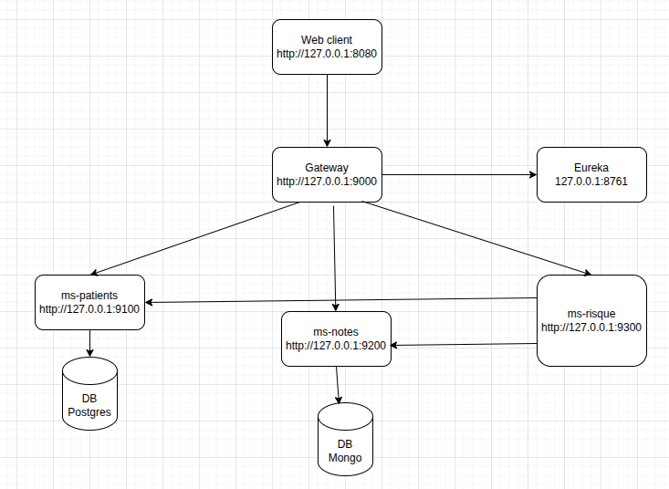

# Étape 6 — Dépistage du risque de diabète (déploiement sur Kubernetes)

> **À propos de ce dossier.** Sixième et dernière étape : le projet de l'étape 5, **déployé
> sur Kubernetes** au lieu de Docker Compose. Le code métier ne change pas ; ce qui change,
> c'est la manière de le faire tourner — manifestes du dossier `k8s/`, et une poignée
> d'adaptations que l'orchestrateur impose, détaillées plus bas.

Application de dépistage à destination des praticiens : elle regroupe les fiches patients,
les notes des consultations, et calcule à partir de ces notes un niveau de risque de
diabète. L'ensemble est découpé en microservices Spring Boot 3.5 / Java 17, orchestrés par
Kubernetes — en local, sur un cluster minikube.

## Architecture

| Module | Port | Rôle |
|---|---|---|
| `ms-commun` | — | bibliothèque partagée : DTO d'API, exceptions métier, traitement uniforme des erreurs |
| `ms-eureka` | 8761 | registre de services |
| `ms-gateway` | 9000 | point d'entrée unique des API |
| `ms-webclient` | 8080 | interface web des praticiens (Thymeleaf) |
| `ms-patients` | 9100 | fiches patients — PostgreSQL 16 |
| `ms-notes` | 9200 | notes des consultations — MongoDB 8 |
| `ms-risque` | 9300 | calcul du niveau de risque |

La passerelle route les appels d'après le nom du microservice, placé en tête de l'URL :
`/ms-patients/patients/1` atteint `GET /patients/1` sur le service des patients. Les trois
microservices métier ne sont exposés hors du cluster par aucun objet : ils ne sont
joignables qu'à travers la passerelle.

Les ports du tableau restent ceux des conteneurs. Sous Kubernetes ils ne sont plus publiés
sur le poste : seule l'interface web l'est, par un Ingress.

## Prérequis

- Java 17, Docker 24+
- `minikube` et `kubectl`, le cluster étant borné pour ne pas assécher le poste :

  ```bash
  minikube start --memory=8g --cpus=8
  docker update --cpus=8 minikube    # le --cpus ci-dessus n'est pas toujours appliqué
  ```

  Sans cette limite, minikube voit toute la machine et peut la saturer. Attention, le nœud
  continue d'**annoncer** la mémoire de l'hôte : l'ordonnanceur croit disposer de plus qu'il
  n'y a, et c'est le noyau qui tranchera. Rester sous les réplicas déclarés ici est donc un
  garde-fou, pas une coquetterie.

  La limite processeur se règle à chaud — `docker update --cpus=N minikube` — sans rien
  détruire, ce qui permet de la chercher par essais. La mémoire, elle, n'est fixée qu'à la
  création du cluster.
- Un nom d'hôte pointant vers le cluster, pour joindre l'interface web :

  ```bash
  echo "$(minikube ip) p09plus.local" | sudo tee -a /etc/hosts
  ```

Les identifiants ne viennent plus d'un `.env` mais du Secret `k8s/00-secrets.yaml`, versionné
avec des valeurs de développement pour que la pile démarre sans préparation.

## Démarrer

```bash
./k8s-start.sh            # démarre minikube au besoin, construit les images, déploie tout
./k8s-stop.sh             # supprime la pile, conserve les données
./k8s-stop.sh --purge     # supprime aussi les volumes des bases
```

Le script construit les images **dans le démon Docker de minikube** plutôt que dans celui du
poste : le cluster les y trouve localement, sans registre à installer ni à alimenter. C'est
ce qui permet aux manifestes de déclarer `imagePullPolicy: Never`. Le premier démarrage est
long, le temps de construire les six images.

**Compter environ une minute avant que la pile réponde**, même une fois tous les pods
affichés `Running`. Chaque microservice doit d'abord se déclarer auprès du registre, puis la
passerelle rafraîchir son catalogue pour savoir où router. Pendant ce laps de temps les
appels échouent : c'est attendu, il n'y a rien à corriger.

De la même manière, après un redémarrage de service, le registre garde en catalogue les
instances disparues jusqu'à expiration de leur bail — une à deux minutes. La passerelle
répartit alors les appels sur des instances mortes et une requête sur *n* échoue. Là non
plus il n'y a rien à corriger : le catalogue se purge seul.

Le cluster lui-même survit à `k8s-stop.sh` ; `minikube stop` l'arrête, `minikube delete` le
supprime — auquel cas les images devront être reconstruites.

En développement, on ne conteneurise que les bases ; les applications tournent en local, hors
du cluster :

```bash
./dev-start.sh                          # bases PostgreSQL et MongoDB, et SonarQube
./mvnw -pl ms-eureka spring-boot:run    # registre à démarrer en premier
./mvnw -pl ms-patients -am spring-boot:run
./dev-stop.sh                           # arrêt, données conservées
```

C'est le seul usage qui reste à Docker Compose dans cette étape : `docker-compose.yml` ne
décrit plus que les deux bases et le serveur d'analyse.

## Ce que Kubernetes change

Le code métier est celui de l'étape 5. Les différences tiennent à ce que l'orchestrateur fait
autrement que Docker Compose.

| Point | Docker Compose | Kubernetes |
|---|---|---|
| Nombre d'instances | `REPLICA_MS_*` du `.env` | champ `replicas` du Deployment (2, 2 et 3) |
| Identifiants | `.env` | Secret `p09plus-secrets` |
| Attente d'un préalable | `condition: service_completed_successfully` | Job + `initContainer` qui sonde la base |
| Données des bases | volumes nommés | StatefulSet et `volumeClaimTemplates` |
| Accès depuis le poste | ports publiés | Ingress nginx sur `p09plus.local` |
| Mise à jour d'une image | `up --build` recrée le conteneur | tag figé : il faut un `rollout restart` |

Deux points méritent d'être détaillés.

**Les instances s'annoncent au registre par leur adresse IP** (`eureka.instance.prefer-ip-address`
dans les `application-docker.yml`). Sous Docker Compose, le DNS de Docker résout les noms de
conteneurs et une instance pouvait s'enregistrer sous le sien. Dans un cluster, le DNS ne
résout que les Services : le nom d'hôte d'un pod n'y répond pas. La passerelle, qui route
d'après le catalogue, échouerait en `SERVFAIL` sur chaque appel. L'IP du pod, elle, est
directement joignable.

**La migration Liquibase est portée par un Job**, et chaque instance de `ms-patients` attend
son résultat par un `initContainer` qui sonde la table d'historique. Kubernetes n'a pas
d'équivalent du `depends_on: condition` de Compose ; sonder la base plutôt que l'API du
cluster évite d'accorder au pod le droit de lire les Jobs. `k8s-start.sh` supprime le Job
avant de le réappliquer, sans quoi un changelog ajouté depuis le dernier démarrage ne serait
jamais joué — un Job terminé n'étant pas rejoué par `kubectl apply`.

## Les manifestes

Le préfixe numérique des fichiers de `k8s/` donne l'ordre de lecture ; `kubectl apply -f k8s/`
les applique tous, l'ordre réel étant assuré par les sondes et l'`initContainer`.

| Fichier | Contenu |
|---|---|
| `00-secrets.yaml` | identifiants partagés par toute la pile |
| `10-patients-db.yaml` | PostgreSQL — StatefulSet, Service headless, volume de 1 Gio |
| `11-notes-db.yaml` | MongoDB — même forme |
| `20-ms-eureka.yaml` | registre de services |
| `21-ms-gateway.yaml` | passerelle |
| `30-ms-patients-migration.yaml` | Job Liquibase, joué avant les fiches patients |
| `31-ms-patients.yaml` | fiches patients — **2 instances**, avec l'`initContainer` d'attente |
| `32-ms-notes.yaml` | notes de consultation — **2 instances** |
| `33-ms-risque.yaml` | calcul du risque — **3 instances**, le service le plus sollicité |
| `40-ms-webclient.yaml` | interface web et son Ingress |

Chaque conteneur déclare ses `resources` et une paire de sondes. La readiness tient compte
des dépendances : un pod qui perd sa base sort du Service sans être tué. La liveness ne juge
que l'application elle-même — sans cette distinction, une base momentanément indisponible
ferait redémarrer en cascade tous ses clients. Le tas de la JVM est borné par
`-XX:MaxRAMPercentage`, faute de quoi elle se dimensionnerait sur la mémoire du nœud et se
ferait tuer pour dépassement de sa limite.

## Construire et vérifier

L'étape est un projet Maven multi-module : les commandes se lancent **depuis la racine de
l'étape**, pas depuis celle du dépôt.

```bash
./mvnw verify                  # compile, teste, et produit les rapports qualité
./mvnw clean verify site site:stage   # + site HTML assemblé dans target/staging
./mvnw -pl ms-risque test      # tests d'un seul module
./mvnw -pl ms-risque -Dtest=EvaluationServiceTest test          # une classe
./mvnw -pl ms-risque -Dtest=EvaluationServiceTest#aucunDeclencheur_retourneNone test   # une méthode
```

Le but de `site:stage` est de rassembler les rapports des modules dans
`target/staging` : sans lui, le menu « Modules » du rapport agrégé renvoie vers des
pages absentes, chaque module écrivant dans son propre `target/site`.

Une fois le site assemblé, ouvrir **`target/staging/index.html`** : ce rapport agrégé
donne accès, par son menu « Modules », au site de chaque microservice — Javadoc, code
source croisé, Checkstyle, PMD, couverture JaCoCo et résultats des tests. Le dossier
`target/` n'étant pas versionné, la page n'existe qu'après la commande ci-dessus.

Les analyses (Checkstyle, PMD, SpotBugs, couverture JaCoCo) sont **indicatives** : elles
n'interrompent pas le build. L'objectif est zéro violation ; les 80 % de JaCoCo, eux, ne
sont qu'un **repère** — la couverture ne porte que sur le code qui décide (DTO, entités,
configurations, convertisseurs, contrôleurs et classes d'amorçage en sont exclus), et un
module sans règle métier peut légitimement rester bas.
Les tests d'intégration démarrent de vraies bases via Testcontainers, Docker doit donc être
disponible.

## Analyse écologique du code

Cette étape ajoute un serveur **SonarQube** doté des règles **creedengo** (Green Code
Initiative, ex-ecoCode), qui repèrent les tournures de code coûteuses en énergie ou en
ressources. C'est un outil de fabrication : il tourne en développement, avec les bases, et
n'a aucune place dans le cluster.

```bash
./dev-start.sh      # démarre aussi SonarQube — comptez une minute
./sonar-scan.sh     # prépare le serveur au premier passage, puis analyse
```

`sonar-scan.sh` est relançable sans effet de bord. Au premier passage il pose ce dont le
serveur a besoin : mot de passe administrateur, jeton d'analyse conservé dans `.sonar-token`
(ignoré par git), et surtout le profil de règles **« creedengo way »** — hérité de « Sonar
way », complété des règles du dépôt `creedengo-java` et promu profil par défaut du langage.
Cette dernière étape n'est pas facultative : **les règles creedengo ne figurent dans aucun
profil livré**, et sans elle l'analyse se déroule sans remonter la moindre remarque
d'écoconception.

Le rapport s'ouvre ensuite sur <http://localhost:9001> (le port 9000 étant déjà pris par la
passerelle en développement local). Identifiants `admin` / `P09plus-Sonar1`.

Attention à la couverture qu'il affiche : **SonarQube ignore les exclusions déclarées pour
JaCoCo** dans le `pom.xml` et rapporte donc un pourcentage sensiblement plus bas (29,9 %
contre le calcul Maven). Les deux chiffres ne mesurent pas la même chose — celui de Maven ne
porte que sur le code qui décide, celui de SonarQube sur tout le code. Se fier au premier.

Deux points à connaître :

- SonarQube embarque Elasticsearch, qui exige `vm.max_map_count ≥ 524288`. `dev-start.sh`
  vérifie le réglage et affiche la commande à passer s'il est insuffisant.
- Les versions de l'image et du greffon sont liées : creedengo 2.2.0 couvre SonarQube 26.1
  à 26.6, d'où le tag figé dans `sonar/Dockerfile`. Ne monter l'une sans vérifier l'autre.

Les remarques d'écoconception ne sont pas des ordres : chacune est arbitrée plutôt que subie.
La première analyse en a donné 205. Après corrections du code et neutralisation motivée des
52 restantes, **le rapport est à zéro remontée** — un état qui a du sens, puisqu'une nouvelle
remarque y sera immédiatement visible. Voici le détail.

| Règle | Occ. | Traitement |
|---|---|---|
| `GCI82` — variable jamais réassignée | 192 puis 31 | `final` posé sur **178** en trois passes ; 47 neutralisées, voir plus bas |
| `GCI76` — collections statiques | 2 | **neutralisées** : `List.of(…)` immuables, la règle vise les collections mutables |
| `GCI67` — `++i` plutôt que `i++` | 1 | appliquée dans `EvaluationService` |
| `GCI2` — cascade de `if-else` | 1 | **neutralisée** : les seuils se comparent avec `>=`, qu'un `switch` n'exprime pas |

**Toute remarque écartée est neutralisée dans le code, jamais dans le tableau de bord.** Le
mécanisme est `@SuppressWarnings("<dépôt>:<règle>")` — par exemple
`@SuppressWarnings("creedengo-java:GCI82")` — surmonté du commentaire qui dit *pourquoi*.
Deux raisons de préférer cela à un « Accepté » posé dans l'IHM de SonarQube : la
justification vit dans le fichier, sous les yeux de qui lira le code ; et elle est versionnée,
donc elle survit à la purge du volume Docker.

L'annotation est posée **au plus près** : sur la classe quand tous ses champs sont concernés
(les DTO), sur le champ pour un `@Value` isolé, sur la méthode pour un paramètre de lambda.
Annoter la classe entière masquerait les occurrences futures, légitimes celles-là.

Les GCI82 écartées le sont pour une raison technique, non par choix :

- **38 champs** — les DTO sont des classes Lombok `@Data @Builder @NoArgsConstructor`, où un
  champ `final` non initialisé ne compile pas, et les champs `@Value` doivent rester
  assignables pour que Spring les injecte ;
- **7 paramètres de lambda**, où `final` impose d'expliciter le type et défigure les
  configurations de sécurité ;
- **2 composants de `record`**, qui n'admettent aucun modificateur — ils sont déjà finaux.

**GCI82 remonte par vagues, il faut donc itérer.** La règle ne signale pas tout d'un coup :
dès qu'un paramètre d'une signature reçoit `final`, elle signale au passage suivant les
autres paramètres de la même signature. Ici 192, puis 23, puis 8 — trois passes avant que le
rapport ne bouge plus. Corriger puis relancer l'analyse est la seule façon d'atteindre ce
point fixe ; une passe unique laisse des méthodes à moitié annotées.

L'analyse remonte aussi les règles « Sonar way » héritées. Ont été corrigés : un import
inutilisé, un `LocalDateTime.now()` sans zone explicite, un accès à une constante par une
sous-interface, deux littéraux de mois remplacés par `java.time.Month` et deux lambdas
d'assertion ramenées à un seul appel susceptible de lever. Deux `S2638` sont neutralisées,
sur le type de retour des gestionnaires hérités de `ResponseEntityExceptionHandler` : les
annoter `@Nullable` satisferait le contrat de Spring mais décrirait faussement notre code,
qui ne renvoie jamais `null`.

## Accès

L'interface web est le seul élément exposé hors du cluster, par l'Ingress :

| Ressource | URL | Identifiants |
|---|---|---|
| Interface web | http://p09plus.local | `app_user` / `app_password` |

Le reste s'atteint en ouvrant un tunnel vers le Service voulu, le temps du diagnostic :

```bash
kubectl port-forward service/ms-gateway 9000:9000   # puis http://localhost:9000/swagger-ui/index.html
kubectl port-forward service/ms-eureka 8761:8761    # puis http://localhost:8761
```

Les appels à la passerelle restent authentifiés en HTTP Basic avec les mêmes identifiants.

## API

Toutes les API exigent une authentification HTTP Basic et sont appelées via la passerelle.

| Méthode | Chemin | Rôle |
|---|---|---|
| `GET` | `/ms-patients/patients` | liste des patients |
| `GET` | `/ms-patients/patients/{id}` | fiche d'un patient |
| `POST` | `/ms-patients/patients` | création d'un patient |
| `PUT` | `/ms-patients/patients/{id}` | mise à jour d'un patient |
| `GET` | `/ms-notes/patients/{id}/notes` | notes d'un patient |
| `POST` | `/ms-notes/patients/{id}/notes` | ajout d'une note |
| `GET` | `/ms-risque/evaluation/{id}` | niveau de risque d'un patient |

Les deux listes sont renvoyées telles quelles, sans enveloppe :

```json
[ { "id": 1, "firstName": "Jean", "lastName": "Dupont", "birthDate": "1990-05-12",
    "gender": "M", "postalAddress": "1 rue des Lilas", "phoneNumber": "100-222-3333" } ]
```

Création d'un patient :

```http
POST /ms-patients/patients
Content-Type: application/json

{
  "firstName": "Jean",
  "lastName": "Dupont",
  "birthDate": "1990-05-12",
  "gender": "M",
  "postalAddress": "1 rue des Lilas",
  "phoneNumber": "100-222-3333"
}
```

```json
{
  "id": 5,
  "firstName": "Jean",
  "lastName": "Dupont",
  "birthDate": "1990-05-12",
  "gender": "M",
  "postalAddress": "1 rue des Lilas",
  "phoneNumber": "100-222-3333"
}
```

Toutes les erreurs partagent le même format, quel que soit le microservice appelé :

```json
{
  "timestamp": "2026-08-01T09:12:33Z",
  "microserviceName": "ms-patients",
  "path": "/patients/42",
  "errorCode": "NOT_FOUND",
  "messages": ["Aucun patient avec l'id: 42"]
}
```

Les statuts distinguent nettement la responsabilité de l'erreur :

- **4xx — la demande est en cause** : `400` donnée invalide, `404` ressource inexistante,
  `409` patient déjà enregistré. Le message métier est renvoyé pour permettre la correction.
- **5xx — le service est en cause** : `503` microservice injoignable, `500` erreur
  inattendue. Seul un message générique est renvoyé ; la cause est journalisée côté serveur.

## Règle d'évaluation du risque

Le niveau est déterminé en croisant le nombre de termes déclencheurs relevés dans les notes,
l'âge du patient et son genre. Les niveaux sont évalués du plus grave au moins grave, de
sorte qu'un nombre de déclencheurs plus élevé ne puisse jamais aboutir à un risque moindre.

| Patient | Early onset | In Danger | Borderline |
|---|---|---|---|
| Homme de moins de 30 ans | ≥ 5 | ≥ 3 | — |
| Femme de moins de 30 ans | ≥ 7 | ≥ 4 | — |
| 30 ans et plus | ≥ 8 | 6 à 7 | 2 à 5 |

Aucun déclencheur donne toujours `None`. Les jeux de données de démonstration contiennent
quatre patients, un par niveau attendu.

## Schéma des microservices


